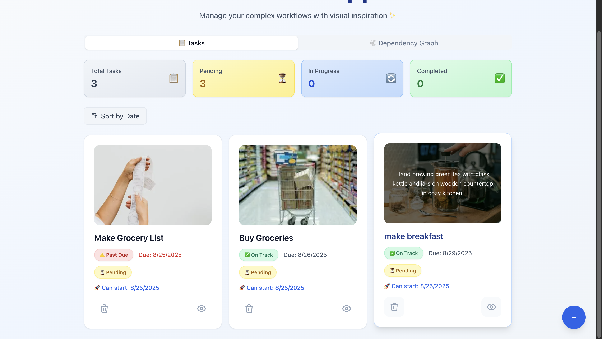
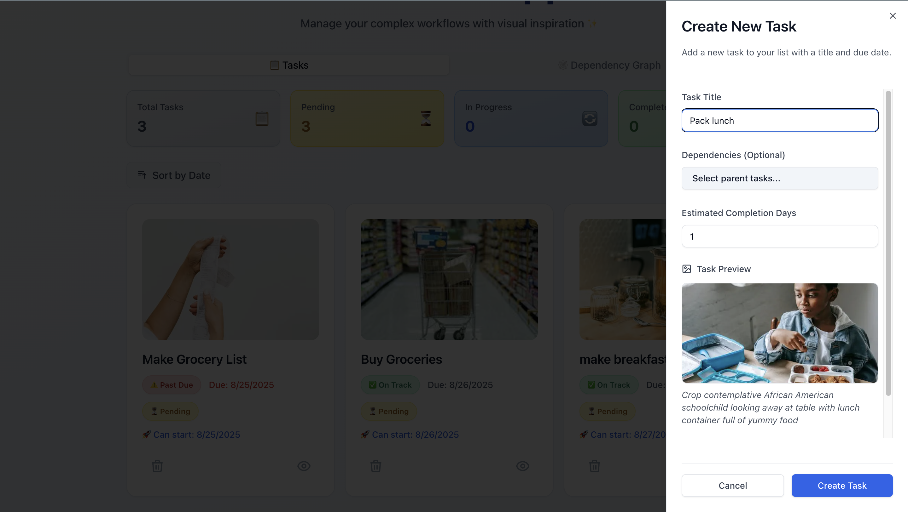
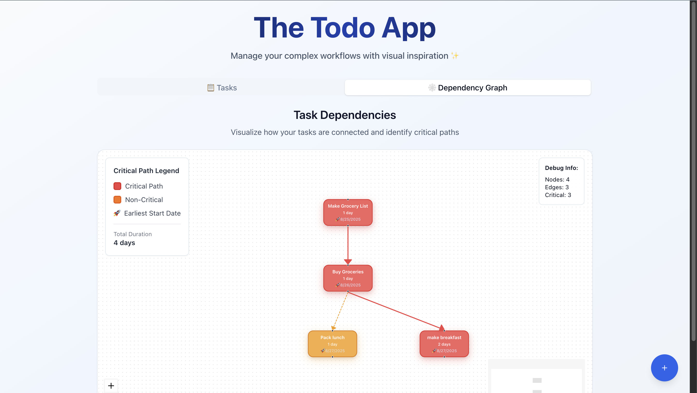
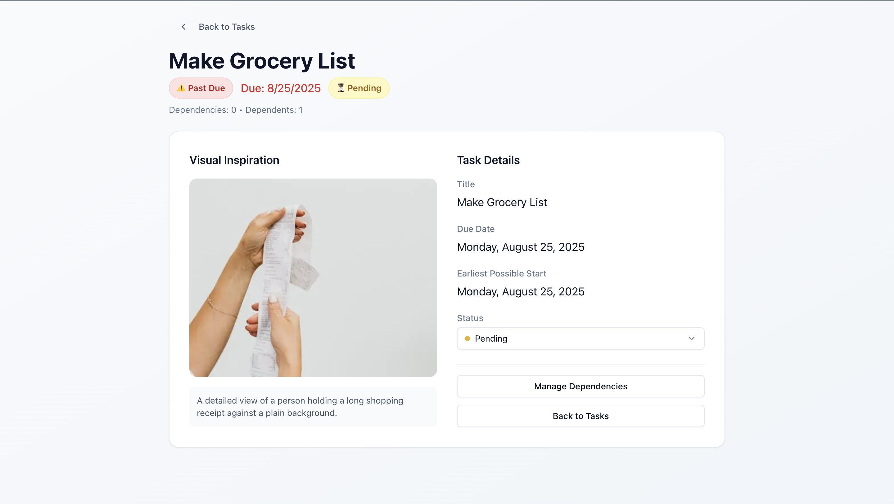

## Soma Capital Technical Assessment

This is a technical assessment as part of the interview process for Soma Capital.

> [!IMPORTANT]  
> You will need a Pexels API key to complete the technical assessment portion of the application. You can sign up for a free API key at https://www.pexels.com/api/

To begin, clone this repository to your local machine.

## Development

This is a [NextJS](https://nextjs.org) app, with a SQLite based backend, intended to be run with the LTS version of Node.

To run the development server:

```bash
npm i
npm run dev
```

## Task:

Modify the code to add support for due dates, image previews, and task dependencies.

### Part 1: Due Dates

When a new task is created, users should be able to set a due date.

When showing the task list is shown, it must display the due date, and if the date is past the current time, the due date should be in red.

### Part 2: Image Generation

When a todo is created, search for and display a relevant image to visualize the task to be done.

To do this, make a request to the [Pexels API](https://www.pexels.com/api/) using the task description as a search query. Display the returned image to the user within the appropriate todo item. While the image is being loaded, indicate a loading state.

You will need to sign up for a free Pexels API key to make the fetch request.

### Part 3: Task Dependencies

Implement a task dependency system that allows tasks to depend on other tasks. The system must:

1. Allow tasks to have multiple dependencies
2. Prevent circular dependencies
3. Show the critical path
4. Calculate the earliest possible start date for each task based on its dependencies
5. Visualize the dependency graph

## Submission:

1. Add a new "Solution" section to this README with a description and screenshot or recording of your solution.
2. Push your changes to a public GitHub repository.
3. Submit a link to your repository in the application form.

## Solution

The solution that I came up with satisfies each of the aforementioned requirements across a variety of cases, while also incorporating certain features that went beyond the scope of the task at hand to demonstrate understanding of more advanced full stack concepts.

### Part 1 - Due Dates

1. I implemented a date picker in the task creation form with standardized timezone handling that synchronizes the due date with the database
2. Added the visual indicator with red highlighting and user friendly icons to indicate if a task was overdue

**Screenshot**


### Part 2 - Image Generation

1. I implemented a modular, standardized singleton implementation of a Pexels client to streamline development
2. Used Tanstack React query to handle loading states in a predictable fashion and created a professional UI with loading skeletons
3. Reworked the UX to show the users a live preview of the image that would be associated with their task using intelligent frontend handling to respect rate limits (debouncing)
4. Image caching by storing the pexels image url in database to avoid repeated refetches since I realized image returned for a given query was fairly deterministic
5. Graceful error handling using react query's error state

**Screenshot**


### Part 3 - Task Dependencies

1. Implemented an extensible, normalized schema design to handle many to many relationships for dependencies using a junction table to model the system as a graph with vertices and edges
2. Implemented a DFS traversal cycle detection algorithm to detect cycles and prevent them from occurring
3. Graceful Error handling with descriptive errors on why adding a dependecy failed
4. Implemented a version of longest path graph traversal by using task duration as weights in the determination of the critical path (https://www.youtube.com/watch?v=rxGcV0tuxRU)
5. Used React Flow to visualize tasks and their dependencies with clear visual indicators, colors and an associated legend
6. Calculated earliest start date using the PDM forward pass algorithm to incrementally track latest starts and latest finish dates to bubble dates over using dependencies. This also gets dynamically recalculated whenever the todos or the dependencies are altered to make sure our database syncs these with the latest updates. (https://www.youtube.com/watch?v=GRlXRYok3oQ&ab_channel=Engineer4Free)

**Screenshot**


### Tasks that were done beyond scope

1. Kept the code clean and maintanable with seperation between layers and modular helper functions
2. Reworked the entire UI/UX on the client side using Shadcn and tailwind to make it look professional, responsive
3. Added a task management status that allows us to track the completion status of a given task
4. Added the ability to add and remove dependecies with UX individual Todo page
5. Maintaining an implementation of browser in memory caching of results to avoid overfetching and increased throughput to the server along with intelligent cache invalidation on update operations to trigger dynamic refetched (Tanstack React Query)
6. Graceful handling of all loading and error states using React Query
7. Database design is clear with indexed foreign keys and relationships - allows for faster retreival
8. Batched certain operations on the backend to make them more efficient
9. Clear code quality - readable code that can be worked with in the future
10. Input validation using zod for server error handling of incoming responses/params
11. Type safety was maintained throughout using shared types between client and server

**Screenshots**



